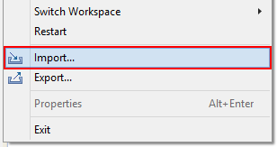
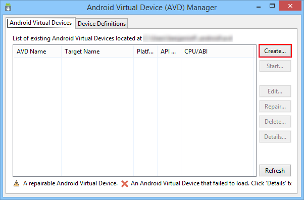
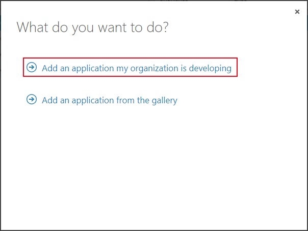
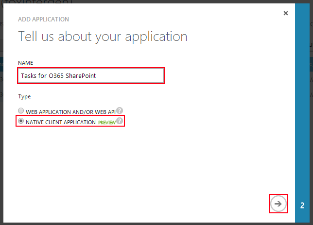
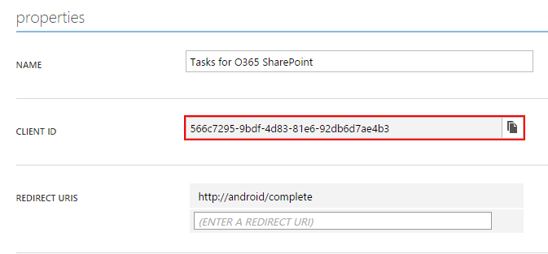
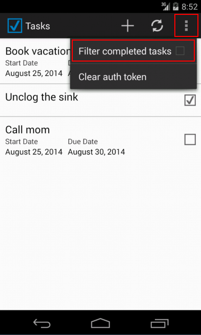

Module 06: *CONSUMING SHAREPOINT APIS WITH ANDROID*
==========================

##Overview

The lab lets students configure and run an Android App which allows the user to edit items in a
SharePoint Task list. The lab also has instructions for adding a new feature to the App.

##Objectives

- Learn how to authenticate with Azure AD from Android using the **Azure Active Directory AuthenticationLibrary (ADAL) for Android**
- Learn how to consume SharePoint APIs from Android using the **Office 365 SDK for Android**
- Implement a new feature in the Android App

##Prerequisites

- [Git version control tool](http://git-scm.com)
- [Eclipse with the Android Developer Tools](http://developer.android.com/sdk/index.html)
- Android API Level 19 installed [using the Android SDK Manager](http://developer.android.com/tools/help/sdk-manager.html)
- You must have an Office 365 tenant and Windows Azure subscription to complete this lab.
- You must have completed Module 04 and linked your Azure subscription with your O365 tenant.

##Exercises

The hands-on lab includes the following exercises:

- [Set up your workspace and configure and run the Android app](#exercise1)
- [Add a "delete" shortcup feature to the app](#exercise2)
- [Add a "filter" feature to the app](#exercise3)

##Exercise 1: Set up your workspace and configure and run the Android app
In this exercise you will set up your Eclipse workspace and then configure and run the
**Tasks for SharePoint O365** Android app.

###Task 1 - Preparation
Prepare the Android SDK by downloading Android API Level 19.

01. Launch Eclipse. Launch the Android SDK Manager via **Window > Android SDK Manager**

    

02. Install the following components from **Android 4.4.2 (API 19)**

    - SDK Platform
    - ARM EABI v7a System Image
    - Intel x86 Atom System Image
    - Sources for Android SDK

    

03. Click **Install packages...** and wait for the install to complete.

**Note:** The android SDK install location will be referred to later using "`ANDROID_SDK`".
By default it is included in the package with Eclipse:

###Task 2 - Set up your Eclipse workspace
Follow these steps to get the source code ready to build on your machine.

01. Launch Eclipse and create a new workspace (if you have not already done so).
    Remember where you create your workspace as we will be working within it extensively.

    For the purposes of this this lab we will refer to the workspace path using "`C:\Android`".

    

02. Start a git command prompt and navigate to your Eclipse workspace.

        C:\> cd Android

    

03. Clone the **Office 365 SDK for Android** into your workspace from github, then checkout
    the revision we're targeting in this lab.
   
        C:\Android> git clone https://github.com/AzureAD/azure-activedirectory-library-for-android.git adal
        C:\Android> cd adal
        C:\Android\adal> git checkout v1.0.1
        C:\Android\adal> cd ..

    

    

04. Clone the **Azure AD Authentication Library for Android** into your workspace from github, then checkout
    the revision we're targeting in this lab.

        C:\Android> git clone https://github.com/OfficeDev/Office-365-SDK-for-Android.git o365-android-sdk
        C:\Android> cd o365-android-sdk
        C:\Android\o365-android-sdk> git checkout v1.0
        C:\Android\o365-android-sdk> cd ..

    

    

05. Clone the **Tasks for SharePoint O365** source code into your workspace from github.
  
        C:\Android> git clone https://github.com/OfficeDev/TODOGITPATHTOSOURCECODE.git o365-tasks

    TODO: screencap

06. Return to Eclipse to import the source code from your workspace.

07. Select **File > Import**. Expand **Android** and select **Existing Android Code Into Workspace**.
    Finally, click **Next**.

    

    

08. For **Root Directory** enter the path to your workspace. Click **Refresh** to search for Android code within
    the workspace.

08. Click **Deselect All** to clear all selections, then select the following projects:

    - `adal\src`
    - `o365-android-sdk\sdk\office-365-base-sdk`
    - `o365-android-sdk\sdk\office-365-lists-sdk`
    - `o365-tasks\src`

    The rest of these projects are test and sample code and can be ignored.

    

09. Finally, click **Finish**

10. We now need to fix some missing dependencies. 
    Execute the "`C:\Android\adal\src\libs\getLibs.ps1`" script to download Gson 2.2.2.

        C:\Android> powershell adal\src\libs\getLibs.ps1

11. Copy `ANDROID_SDK\extras\android\support\v4\android-support-v4.jar` into `C:\Android\adal\src\libs`.

13. Execute the "`C:\Android\o365-android-sdk\sdk\office365-base-sdk\libs\getLibs.ps1`" script to download Guava 16.0.1.

        C:\Android> powershell o365-android-sdk\sdk\office365-base-sdk\libs\getLibs.ps1

14. Return to Eclipse and press **F5** to refresh. Wait a moment as Eclipse re-compiles the code. If everything
    has been done correctly, then there should be no more red entries in the **Problems** window.

    If there are any remaining error messages in the **Problems** window, please troubleshoot them before continuing.

In this task we created an Eclipse workspace, copied our code into it and got it into a working state.

###Task 3 - Create and launch the emulator

In this task we will configure and launch the Android emulator, and deploy the app.

02. Launch the Android Device Manager from **Window > Android Virtual Device Manager**.
    
    Click **Create** to create a new virtual device.

    

    **Note** please be patient - launching the emulator will take some time.

03. Fill out the dialog.

    - For **Device** select "Nexus 4"
    - For **Target** select "API Level 19"
    - For **CPU/ABI** select "Intel Atom (x86)" if available, otherwise "ARM"
    - For **Skin** select "Skin with dynamic hardware controls"
    
    Internal storage should be at least 200mb, and no SD card is required.

    **Note:** if you select the x86 image, and have the [Intel HAXM driver][haxm-driver] installed then the Android emulator will be
    emulated natively using your machine's virtualization hardware. This significantly improves performance of the emulator.

[haxm-driver]: https://software.intel.com/en-us/android/articles/intel-hardware-accelerated-execution-manager

    

04. Click **OK** to create the device.

05. Dismiss the AVD manager. In the Package Explorer, right-click on **o365-tasks** and select **Debug as > Android Application**.

    

    This will launch the Android Device Chooser.

06. Select **Launch a new Android Virtual Device**. 
    Select the AVD you created in the previous steps.
    Finally, select **OK**.

    

07. The android emulator will launch and Android will boot (this may take some time).

    

08. When the android emulator has started the Tasks app should be automatically deployed and launched. If it
    is not, try executing **Debug as > Android Application** again. This time, select the already-running emulator.
    There is no need to restart the emulator.

    

Finally! The application is running. Unfortunately it's not yet properly configured. In the next step we'll configure
the app to work against your own O365 tenant.

###Task 4 - Configure the code for your own O365 tenant

In this task we will create an Application in Azure AD to represent our android app.

01. Navigate your web browser to the [Azure portal](http://manage.windowsazure.com).

02. Navigate to the **Active Directory** extension.

    

03. Navigate to the AD instance for your O365 tenant.

    

04. Navigate to the **Applications** screen.

    

05. From the action bar at the bottom of the page, click **Add**. Then click **Add an application my organization is developing**.

    

    

06. For the name field enter "Tasks for O365 SharePoint". For type select "Native client application", then click **Next**.

    

07. For the Redirect Uri field enter "`http://android/complete`", then click **Next**.

    

08.  When the app has been created, navigate to the screen for that app. **Note:** this may happen automatically.

    

09. Switch to the **Configure** tab

    

10. Scroll down to the _Properties_ section and copy the **Client Id**. Remember this value for later, as we will use it
    when we are configuring the app in the next step.

    

10. Scroll down to the to the _Permissions to other applications_ section and add the following Delegated Permissions 
    for "Office 365 SharePoint Online".

    - Create or delete items and lists in all site collections

    

11. Click **Save** to apply the changes.

    

Done! The **Client Id** we created above will be used to configure the Android app in the next task.

###Task 5 - Configure the code for your own O365 tenant

In this task we will configure the app to work agains your own O365 tenant.

01. Return to Eclipse. Locate the Java class `com.microsoft.o365_tasks.Constants`. This can be found by expanding 
    the nodes **o365-tasks**, **src** and **com.microsoft.o365_tasks** in the Package Explorer.

    

02. Change the constants in this class to suit your own tenancy.

    - Set **`AAD_DOMAIN`** to your O365 tenant domain. E.g. "mycompany.onmicrosoft.com"
    - Set **`AAD_CLIENT_ID`** to the Client Id obtained during Task 4
    - Set **`SHAREPOINT_URL`** to the root url for your O365 SharePoint instance.

    

###Task 6 - Launch the application

We're ready to launch the app now.

01. Once again, right-click on **o365-tasks** and use **Debug as > Android Application** to launch the application.
    If the emulator is already running there is no need to restart it.

02. When the application launches, click **Sign in**.

    

03. You will be prompted to enter your sign-in credentials. Enter them and click **Sign in**.

    

04. If you authenticate successfully the app will automatically create a new Tasks list in SharePoint, and
    populate it with some example data.

    

That's it! You've successfully configured and deployed the "Tasks for O365 SharePoint" app. Try creating and updating
some of the tasks in this list.

Using the **Clear auth token** function from the menu on this screen will clear your current Access Token. Your next request
to the server (e.g. when you refresh the list or create a new task) will trigger a dialog asking you to re-authenticate.

##Exercise 2: Add a "delete" shortcup feature to the app

In this exercise we will add a "Delete" context action to the List Tasks activity.

###Task 1 - Write the new Delete feature

01. Return to Eclipse.

02. First we will create a "menu template" which defines the items in our new context menu.
    In the Package Explorer, expand the `res/menu` folders.

03. Right-click `menu` and select **New > Android XML file**.

    

04. Name the file `list_tasks_context`. The root element type should be `menu`. Click **Finish** to continue.

    

05. Click the `list_tasks_context.xml` tab to switch to XML mode, and paste in the following XML:

        <item
            android:id="@+id/action_delete"
            android:orderInCategory="200"
            android:showAsAction="ifRoom"
            android:icon="@drawable/ic_action_discard"
            android:title="@string/action_delete" />

    

    Save the file. This xml defines a button with the label "Delete" (defined in `res/values/strings.xml`) and the 
    id `action_delete`.

06. Navigate to the java class `com.microsoft.o365_tasks.ListTasksActivity` (this is located in the `src` folder).

    In this class we need to add a number of callbacks to inflate the context menu and hook up handler functions for
    the buttons defined in this menu.

    

07. At the top of the file, add the following imports:
        
        import android.app.AlertDialog;
        import android.content.DialogInterface;
        import android.view.ContextMenu;
        import android.view.ContextMenu.ContextMenuInfo;
        import android.widget.AdapterView.AdapterContextMenuInfo;

    The result should look like this:

    

07. In the `onCreate` function, just before the call to `optionsActionRefresh`, paste the following:

        registerForContextMenu(mListView);

    The result should look like this:

    

    This function registers the `mListView` view for a context menu.

08. Under the comment "`//#### Context menu ####`" paste the following:

        @Override
        public void onCreateContextMenu(ContextMenu menu, View v, ContextMenuInfo menuInfo) {
            getMenuInflater().inflate(R.menu.list_tasks_context, menu);
        }

    This function is invoked by Android to _inflate_ a menu for the given view element `v`, when v has been registered
    for a context menu.
   
09. Next, add this block:
    
        public boolean onContextItemSelected(MenuItem item) {
            AdapterContextMenuInfo info = (AdapterContextMenuInfo) item.getMenuInfo();
            switch (item.getItemId()) {
            case R.id.action_delete:
                contextActionDelete(info);
                return true;
            }
            return super.onContextItemSelected(item);
        }

    This function is invoked by android whenever a context menu item is long-pressed. We use it to link menu items up with
    behaviours. Here we are invoking `contextActionDelete` whenever the users taps the `action_delete` menu item.

    The `getItemId()` call returns the tools-generated integer id of the menu item. We compare this to the tools-generated
    static class field `R.id.action_delete` which was auto-generated based on the XML we added to `list_tasks_context.xml`.

10. Next, add this block:

        private void contextActionDelete(AdapterContextMenuInfo info) {
            final TaskModel task = (TaskModel) mListView.getItemAtPosition(info.position);
            //Launch confirmation dialog
            new AlertDialog.Builder(this)
                .setTitle(R.string.dialog_confirm_title)
                .setMessage(R.string.dialog_delete_confirm_message)
                .setNegativeButton(R.string.label_cancel, null)
                .setPositiveButton(R.string.label_delete, new DialogInterface.OnClickListener() {
                    @Override public void onClick(DialogInterface dialog, int which) {
                        //user has confirmed
                        ensureAuthenticated(new Runnable() {
                            @Override public void run() {
                                deleteTask(task);
                            }
                        });
                    }
                })
                .create()
                .show();
        }
    
    This function handles launching a confirmation dialog for the user. If the user selects the "Delete" button, then
    we ensure that the user is still authenticated and invoke `deleteTask`.

11. Finally, add this block:
    
        protected void deleteTask(final TaskModel model) {
           //Launch a background task to delete the current task
           final String message = getString(R.string.edit_task_working);
           new ProgressDialogAsyncTask<Void>(this, message) {
                // Executes on a background thread. We can safely block here.
                @Override protected Void doInBackground(Void... params) {
                    try {
                        new TaskListItemDataSource(mApplication).deleteTask(model);
                    }
                    catch (Exception ex) {
                        Log.e(TAG, "Error deleting task", ex);
                    }
                    return null;
                }
                // Executes on the UI thread after the background thread completes.
                @Override protected void onResult(Void result) {
                    //all done - refresh the list
                    refresh();
                }
           }
           .execute();
        }

    This function launches an "in progress" dialog and deletes the given task via the API. When finished it starts
    a refresh.

12. **Note:** before continuing make sure that there are not errors in the file.
    Errors will be marked with a red squiggle automatically:

    

    If you find any errors, hover the mouse over them to see if Eclipse can provide a quick fix:

    

Done! We've just added the ability for the user to delete a task item directly from the List Tasks activity.

###Task 2 - Test the new Delete feature

In this task we will test the "Delete" feature we just added.

01. Start debugging the **o365-tasks** app with **Debug as > Android Application**. When the app launches, sign in.

02. Long-press on any task in the list - a context menu will appear. Select **Delete**.

    

03. Tap **Delete** to confirm.

    

04. The item will be deleted and the view will refresh.

Done! You've successfully added a feature to this app.

##Exercise 3: Add a "filter" feature to the app
In this exercise we will add a "Filter" option to the List Tasks activity.

###Task 1 - Write the new filter feature

01. Return to Eclipse.

02. First we will update the List Tasks activity options menu.
    Navigate to the "`list_tasks_options.xml`" menu template.

    

03. Switch to the XML view.

    

04. Add the following XML:

        <item
            android:id="@+id/action_filter_completed"
            android:orderInCategory="800"
            android:showAsAction="never"
            android:checkable="true"
            android:title="@string/action_filter_completed" />

    The result should look like this:

    

05. Navigate to the "`strings.xml`" resouce file and switch to the XML view.

    

06. Add the following XML:

        <string name="action_filter_completed">Filter completed tasks</string>

    The result should look like this:

    

07. Navigate back to the java class `com.microsoft.o365_tasks.ListTasksActivity`. Add the following import
    statements to the top of the file:
        
        import com.microsoft.office365.Query;
        import android.content.SharedPreferences;

    The result should look like this:

    

09. At the bottom of the `ListTasksActivity` class add the following block:
    
        private static class PreferencesWrapper {
            private static final String PREFS_FILTER_COMPLETED = "filter_completed";
            private SharedPreferences mPreferences;
            public PreferencesWrapper(SharedPreferences preferences) {
                mPreferences = preferences;
            }
            public boolean getFilterCompleted() {
                return mPreferences.getBoolean(PREFS_FILTER_COMPLETED, false);
            }
            public void setFilterCompleted(boolean completed) {
                mPreferences.edit()
                            .putBoolean(PREFS_FILTER_COMPLETED, completed)
                            .apply();
            }
        }

    This internal static class wraps the android `SharedPreferences` utility to give us a nice strongly-typed
    interface.

    **Note:** this block must be pasted **inside** the final brace in the file - Java does not support multiple
    seperate class definitions per file.

10. At the top of the class add the following member variable:

        private PreferencesWrapper mPreferences;

    The result should look like this:

    

12. Next, initialize the variable in the "`onCreate`" function:

        mPreferences = new PreferencesWrapper(mApplication.getSharedPreferences("listtasks_prefs", Context.MODE_PRIVATE));

    The result should look like this:

    

13. In the "`onCreateOptionsMenu`" function we must retrieve and initialize the `action_filter_completed` checkbox we
    defined earlier. Add the following line before the final `return`.

        menu.findItem(R.id.action_filter_completed).setChecked(mPreferences.getFilterCompleted());

    The result should look like this:

    

14. In the "`onOptionsItemSelected`" function we must add code to handle taps on the new menu option. Add the following
    switch case:

        case R.id.action_filter_completed:
            optionsActionFilterCompleted(item);
            return true;

    The result should look like this:

    

15. Next add the "`optionsActionFilterCompleted`" function which will handle updating the `action_filter_completed` menu
    item and refreshing the screen.

        private void optionsActionFilterCompleted(MenuItem item) {   
            boolean flag = !item.isChecked();
            item.setChecked(flag);
            mPreferences.setFilterCompleted(flag);
            //refresh
            optionsActionRefresh();
        }

16. Finally, navigate to the "`refresh``" function and add the following code to the "`doInBackground`" inner function:

        Query query = new Query();
        if (mPreferences.getFilterCompleted()) {
            query.field("PercentComplete").lt(TaskModel.COMPLETED_MAX);
        }
        
    Change the `getTasksByQuery` function call to pass the new `query` variable in argument.

    The result should look like this:

    

Done! These changes add a filter on the `PercentComplete` field to the OData query sent to SharePoint when the
"Filter completed tasks" option is checked. This filters out any tasks which have been marked as 100% complete.

Note that this setting is automatically persisted thanks to our use of the Android `SharedPreferences` class.

###Task 2 - Test the new Filter function

In this task we will test the "Filter" function we just implemented.

01. Start debugging the **o365-tasks** app with **Debug as > Android Application**. When the app launches, sign in.

02. When the List Tasks activity has loaded, tap the **Options menu** button in the top-right.
    Next, tap **Filter completed tasks** to confirm.

    

04. The view will refresh, and all "completed" tasks will be filtered out. Repeating the operation will disable
    the filtering.

##Summary

By completing this hands-on lab you have learnt:

01. Some of the basics of Android development.

02. How to use the 0365 SharePoint Lists API for Android 

03. How to filter queries with the 0365 SharePoint Lists API for Android 

